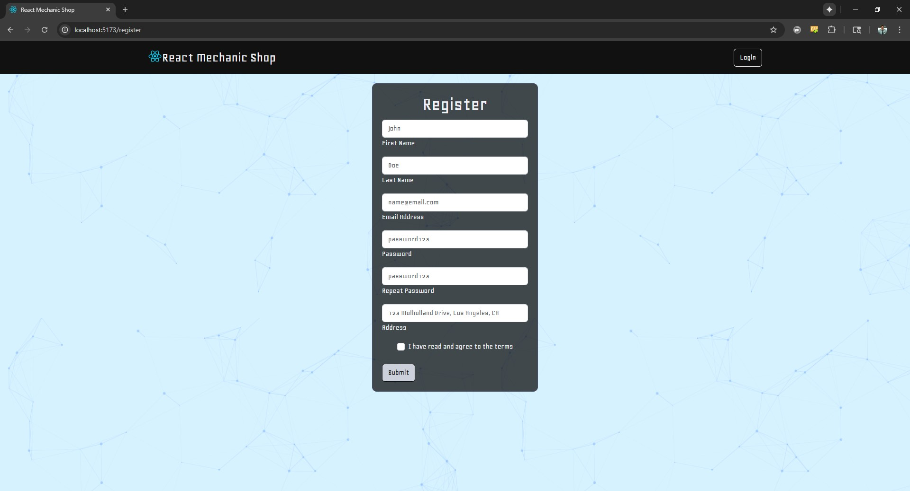
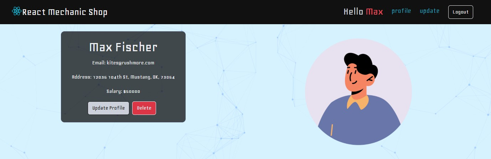
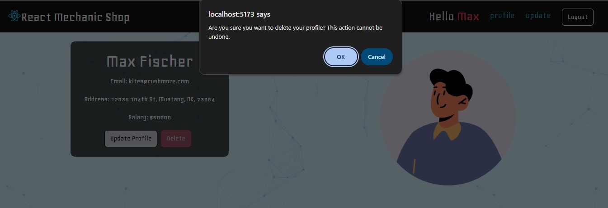
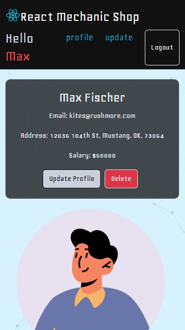
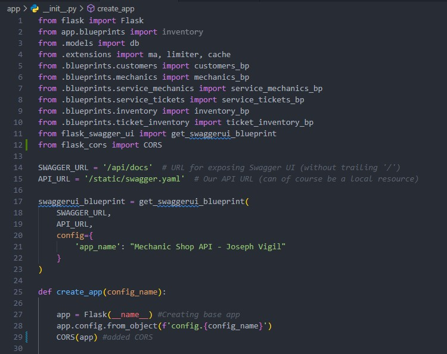
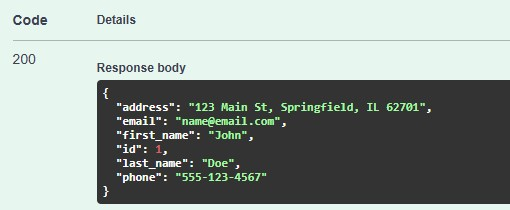

# hw29-react-mechanic-shop-crud

*Create a React front end for your Mechanic Workshop Flask Backend.*

## Preview

Vercel Link: 
*(Render backend may be asleep, please allow time to wake up)*
https://mech-shop-lovat.vercel.app/

### desktop




### mobile 


## Flask Touch-Up

Before starting, ensure that you have **CORS** active on your Flask server:

1. Install flask-cors:
    ```bash
    pip install flask-cors
    pip freeze > requirements.txt
    ```
2. In your app's `__init__.py` file:
    ```python
    from flask_cors import CORS
    ```
3. Add inside your `create_app()` function:
    ```python
    CORS(app)
    ```
added cors to flask app:


> **Note:**  
> If your app isn't deployed, you can run your Flask app locally and make API requests from your React app to `localhost:5000` (similar to Postman).

## Render free DB is deactivated to so need to make a new one
```txt
1. created new render database **mechanic_db2**
2. get external db url from new db -> replace render web service environment variable 
3. pushing commit now to trigger github actions
```
new database is connected:



## Fixing Routing on Vercel

1. Create a `vercel.json` file in the root of your project:
```json
{
   "rewrites":  [
       {"source": "/(.*)", "destination": "/"}
    ]
}
```

## Fixing Images on Vercel

make sure to put images in `public` and `assets`folder and reference them like this:
```jsx

```
```css
body {
  background-image: url('./assets/oxygen.png');
}
```


## React Front End

Create a front end for your Mechanic Shop API, similar to what we did in class.

### Basic Requirements

- **Utilize CRUD endpoints for mechanics**
- **Register a Mechanic**
- **Log a mechanic in**
- **View the mechanic's profile**
- **Update the mechanic**
- **Delete the mechanic**

#### Bonus

- Display mechanic tickets

## React Toolbelt

### React-router-dom

- **BrowserRouter**: Wraps the whole app to create a routing network
- **Routes**: Component that wraps around individual routes
- **Route**: Establishes a path (endpoint) to an element (view/page)

### useEffect

- Handles side effects
- `[]`: Empty dependency array triggers useEffect only on mount
- `[value1, value2]`: Triggers useEffect on mount and when any listed value updates
- Commonly used for API requests
- **Reference usage examples as needed**

### useState

- Returns an array with a state value and a set state function
- Always use the set state function to update the state value
- Set state functions trigger a rerender (not a refresh), preserving state and showing updates
- Example:
  ```js
  const [value, setValue] = useState('');
  ```
- Parameters of useState are the default values

### useContext

- Creates a cloud of data accessible at any app level
- Solves prop drilling
- Useful for theme setting and authentication

## Organization

### Controlled Components (Forms)

- Components with forms should be controlled
- Input value changes should update state value
- State value changes should update input value

### Views

- Collection of components (actual pages to navigate to)

### Component

- Individual unit:
  - Forms
  - Buttons
  - Partial displays
  - Cards

## Notes (for personal reference)

**Terminal commands: (make reacted javascript project and install react-router-dom)**
```bash
npm create vite@latest
npm install react-router-dom
```
**jsx snippets:**
```jsx
rafce
```

**Dylan's related projects:**

https://github.com/dkatina/fullstack-frontend

https://github.com/dkatina/WM-backend

https://github.com/dkatina/react-ecom